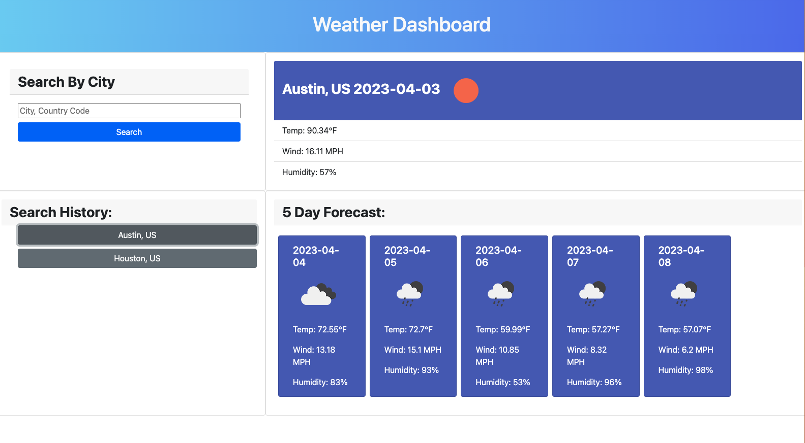

# weather-dashboard

## Description

I created this project in order to see the current and future weather outlook of multiple cities. This app allows a user to see their search history and input new cities to be searched on one page. Throughout creating this project, I learned how to utilize server-side APIs. I also learned to how create my own API key and how to use the fetch API to read and play with data.

## Usage

[This is the link to the completed application](https://erothman1.github.io/weather-dashboard/)

This is a screenshot to the completed application:

## Credits

I utilized the [OpenWeather API](https://openweathermap.org/api) for this project.

## How to Contribute

For information on how to contribute to this project, please email me at elva.rothman.developer@gmail.com!